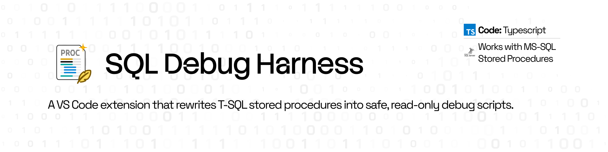

# SQL Debug Harness — VS Code Extension



**Documentation:** [deeprajdeveloper.github.io/vscode-sql-debug-harness](https://deeprajdeveloper.github.io/vscode-sql-debug-harness/) · [Technical design](docs/TECHNICAL_DESIGN.md) · [Change history](docs/change-history.html)

Statically rewrite a T-SQL stored procedure into a **safe debug script**: durable-table DML becomes `SELECT` previews (temp tables and table variables stay live), transactions are neutralized, and variables are traced — so you can run the script without mutating real tables.

> **Not a live debugger.** This generates a static harness script — no breakpoints or step-into on SQL Server.

**No Python required.** The transform engine runs in-process inside the extension (TypeScript). Install from the Marketplace (or a VSIX) and go.

---

## Overview

Stored procedures are hard to reason about from a script diff alone. You can read a `CREATE PROCEDURE` top to bottom and still not be fully certain which rows an `UPDATE` will touch — until it has already run.

SQL Debug Harness statically rewrites a T-SQL stored procedure so side-effecting statements become read-only previews — runnable against a real connection without writing anything. The engine is TypeScript and runs in-process.

<video src="images/workbench-preview.mp4" controls playsinline width="100%" title="Workbench preview of SQL Debug Harness in VS Code">
  <a href="images/workbench-preview.mp4">Download the workbench preview (MP4)</a>
</video>

*Workbench preview — analyze a procedure and generate a debug harness in VS Code.*

---

## Before / after

Interactive scenarios (durable DML, temp tables, bare IF/ELSE, trace styles) live on the
[user documentation](https://deeprajdeveloper.github.io/vscode-sql-debug-harness/#examples) site.
A few representative excerpts:

### Durable-table DML

**Input**

```sql
CREATE PROCEDURE dbo.usp_SimpleDml
    @Id INT,
    @Name NVARCHAR(100)
AS
BEGIN
    INSERT INTO dbo.Items (Id, Name) VALUES (@Id, @Name);
    UPDATE dbo.Items SET Name = @Name WHERE Id = @Id;
END
```

**Generated harness** (excerpt)

```sql
-- [DBG] Harness: was CREATE PROCEDURE dbo.usp_SimpleDml; set parameter values below.
DECLARE @Id INT = NULL,  -- TODO: set test value
        @Name NVARCHAR(100) = NULL;  -- TODO: set test value
    -- [DBG-PREVIEW] Would have executed:
    SELECT N'INSERT to table dbo.Items' AS [DBG_Action], @Id AS [@Id], @Name AS [@Name];
    -- [DBG-PREVIEW] Would have executed:
    SELECT N'UPDATE to table dbo.Items' AS [DBG_Action], @Name AS [@Name]
    FROM dbo.Items
    WHERE Id = @Id;
```

### Temp tables stay live

```sql
-- Input keeps both; harness only previews dbo.Items
INSERT INTO #Temp (Id) VALUES (@Id);      -- left live
INSERT INTO dbo.Items (Id) VALUES (@Id);  -- → SELECT preview
```

### Bare IF / ELSE wrapping

```sql
-- Input
IF @Var1 >= 0
  SET @Var2 = 1
ELSE
  SET @Var2 = 0

-- Harness (default select traces)
IF @Var1 >= 0
  BEGIN
      SET @Var2 = 1
      SELECT 'DBG' [NOTES], @Var2 [Var2];
  END
ELSE
  BEGIN
      SET @Var2 = 0
      SELECT 'DBG' [NOTES], @Var2 [Var2];
  END
```

---

## Quickstart (< 5 minutes)

1. Install **SQL Debug Harness** from the VS Code Marketplace (or `code --install-extension dist/sql-debug-harness.vsix`).
2. Open [`samples/fixtures/simple_dml.sql`](samples/fixtures/simple_dml.sql) (or any `.sql` stored procedure).
3. Right-click → **SQL Debug Harness** → **Generate Debug Script**.
4. Review the harness in the **Workbench** — durable-table DML is preview-only; set `DECLARE` values and run against a safe connection.

Optional: **Analyze Procedure** shows Summary / Warnings / Identified in the Workbench tab.

---

## What’s new in 0.0.4

- Temporary-table DML (`#temp` / `##temp`) stays live in the harness, same as table-variable DML — only durable-table writes are previewed.
- Bare `IF` / `ELSE` / `WHILE` assignments wrap in `BEGIN`…`END` with the variable trace so branches stay valid.

See the full [change history](docs/change-history.html).

---

### Open from the sidebar

Click the **SQL Debug Harness** icon in the primary activity bar (left). The sidebar includes Open Workbench, Analyze, and Generate actions plus grouped **Analyzed** / **Debugged** procedure history.

**Loading SQL:** use **Select File…** in the workbench (Quick Pick of workspace `.sql` files), **Load Active** for the open editor, or right-click a file → **Open in Workbench**.

## Commands

| Command | Action |
|---------|--------|
| **Open Workbench** | Open the workbench anytime (empty, or with the active SQL file/selection) |
| **Generate Debug Script** | Build harness script and show it in the **Workbench** |
| **Analyze Procedure** | Run analysis and show it in the **Workbench** |
| **Configure Settings** | Interactive settings picker |

The **Workbench** shows:

- **Source** — selected text or full `.sql` file (**Select File…** or **Load Active**)
- **Debug script** — generated harness (when available)
- **Analysis** — Summary / Warnings tabs plus Identified results grouped by Kind
- **Active log** — step-by-step engine log (collapsible)

Panes are **resizable** (drag the splitters). Click the full Analysis or Active Log header to collapse it; panel order and collapse state are preserved. Source and Debug previews use **T-SQL syntax highlighting**, theme colors, and horizontal scrolling for long lines.

From the toolbar you can open **History**, **Analyze**, **Generate**, **Clear** generated output, and use **Save** for analysis `.txt`, debug `.sql`, log `.log`, or open the debug script in an editor tab.

Available from the **SQL Debug Harness** right-click submenu on `.sql` files and from the Command Palette. Non-empty editor selections are used when present.

## Settings

| Setting | Default | Description |
|---------|---------|-------------|
| `spDebug.traceStyle` | `select` | `select`, `print`, `printCombined`, or `raiserror` for variable traces |
| `spDebug.logToOutput` | `true` | Show step log in the **SQL Debug Harness** output channel |
| `spDebug.saveLogFile` | `false` | Also write `<proc>.log` beside the source `.sql` |
| `spDebug.quietWhenLogging` | `true` | Avoid duplicating progress lines when the step log is enabled |
| `spDebug.workbenchToolbarStyle` | `iconsAndText` | `iconsAndText`, `iconsOnly`, or `textOnly` |

---

## Limitations (trust boundary)

This tool prioritizes **correctness over coverage**. If something cannot be rewritten safely, it is flagged — not silently left as live durable-table DML.

- **T-SQL only** for v1 (no PostgreSQL / Oracle / MySQL dialects yet).
- **Static rewrite only** — not a live/step-through debugger.
- **Temp tables / table variables** — DML against `#temp`, `##temp`, and `@tableVar` is intentionally left live (session-scoped only).
- **Dynamic SQL** (`EXEC(@sql)`, `sp_executesql`) is detected and warned; not rewritten.
- **Cursors / `WHILE`** — detected and warned; rewriting inside them is best-effort.
- **`MERGE` / `OUTPUT`** — flagged; MERGE is disabled rather than incorrectly previewed.
- **Stored procedures** are the target — not arbitrary ad-hoc DDL/DML scripts.
- **No live DB connection** in the extension — generate the script, then run it yourself (e.g. in SSMS / Azure Data Studio).

---

## Why no Python backend?

Earlier versions shelled out to a PyPI package. That forced every user to have Python on PATH, survive first-run `pip install`, and deal with corporate lockdown / wrong interpreters. VS Code already runs Node.js, so the engine was ported to TypeScript and ships **inside the VSIX**. Installing the extension is the entire setup.

The engine uses a **hybrid** approach: optional AST via `node-sql-parser` (TransactSQL) plus text-scan / regex transforms for real enterprise T-SQL (`TRY/CATCH`, multi-line DML, etc.) where full AST parsing often fails.

## Optional CLI (`npx`)

Same engine, outside the editor:

```bash
npx sql-debug-harness generate -i MyProc.sql -o MyProc_debug.sql
npx sql-debug-harness analyze -i MyProc.sql
npx sql-debug-harness version
```

| Flag | Meaning |
|------|---------|
| `-i` / `--input` | Input `.sql` path, or `-` for stdin |
| `-o` / `--output` | Output path for `generate` (default: stdout) |
| `--trace-style` | `select` (default), `print`, `printCombined`, or `raiserror` |

(When developing from this repo: `npm run compile && node out/cli.js generate -i …`.)

## Local development

```bash
git clone https://github.com/DeeprajDeveloper/vscode-sql-debug-harness.git
cd vscode-sql-debug-harness
npm install
npm test
npm run compile
```

Press **F5** to launch an Extension Development Host.

### Package a VSIX

```bash
npm run package
code --install-extension dist/sql-debug-harness.vsix
```

### Publish to the Marketplace

Requires an Azure DevOps PAT with **Marketplace → Manage** (Organization: **All accessible organizations**).

```bash
export VSCE_PAT="your-token"
npm run publish              # runs check + tests, then uploads 0.0.x
npm run publish:dry-run      # package only, no upload
./scripts/publish-marketplace.sh --skip-tests --yes
```

After publish, the listing is at:
[marketplace.visualstudio.com/items?itemName=DeeprajAdhikary.sql-debug-harness](https://marketplace.visualstudio.com/items?itemName=DeeprajAdhikary.sql-debug-harness)

## Roadmap

- v2 ideas: optional connect-and-run inside `BEGIN…ROLLBACK`, richer control-flow handling, and multi-dialect support (the parser stack already spans multiple SQL dialects).

## License

MIT
